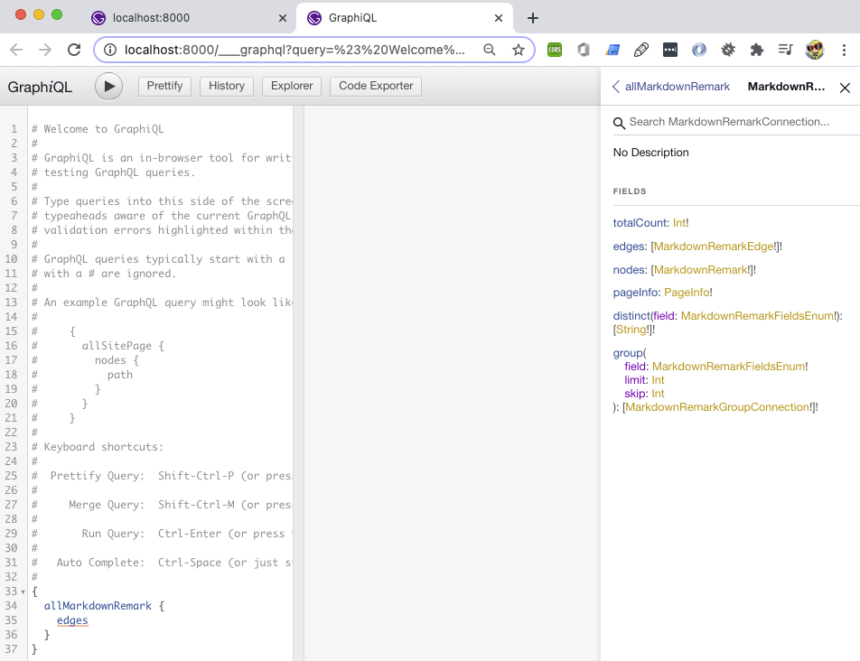

<p align="center">
    
</p>
<h1 align="center">
  Gatsby Blog
</h1>

### What is this about?

- a Gatsby site that dynamically renders Markdown files from the local filesystem into HTML
- GraphQL is used to query posts to display results on pages
- linking between posts
- grouping posts by tags

### This Repo is based on:

- [egghead video course](https://egghead.io/courses/build-a-blog-with-react-and-markdown-using-gatsby), also see [egghead GitHub Repo to this](https://github.com/eggheadio-projects/build-a-blog-with-react-and-markdown-using-gatsby-notes)
- Basis to start is the [Gatsby Hello World Repository](https://github.com/gatsbyjs/gatsby-starter-hello-world)

### How to run this?

- clone this repo
- cd into project
- `npm install`
- run `gatsby develop`
- should now run on `http://localhost:8000/`

### Important heads-up

If something's fishy (weird errors in terminal), use `gatsby clean` inbetween and run `gatsby develop` again.
For the times you need to restart the gatsby server, quitting the running process with `control c` in your terminal might work better than following refresh pop-ups on localhost.

### Tutorial Steps

[Tutorial 1 - Project set-up](#tutorial-1)

[Tutorial 2 - Install plugins for transforming markdown, create `gatsby-config.js`](#tutorial-2)

[Tutorial 3 - Create and format markdown directories and files](#tutorial-3)

[Tutorial 4 - What's GraphiQL Browser to check for building queries for Gatsby](#tutorial-4)

[Tutorial 5 - Create Home layout component with a GraphQL query](#tutorial-5)

[Tutorial 6 - Clean up `index.js`, create Header component](#tutorial-6)

[Tutorial 7 - Add list of posts to the blog site with GraphQL page query](#tutorial-7)

[Tutorial 8 - Build page slugs dynamically from markdown](#tutorial-8)

[Tutorial 9 - Build dynamic blog posts](#tutorial-9)

[Tutorial 10 - Add "next" and "previous" links](#tutorial-10)

[Tutorial 11 - Expose tags data for blog](#tutorial-11)

[Tutorial 12 - Use `pageContext` to display tags](#tutorial-12)

[Tutorial 13 - Deploy site with netlify](#tutorial-13)

### Tutorial 1

#### Project setup

- set up project folder
- install Gatsby `npm install --global gatsby@next gatsby-cli@next`
- cd into the project
- run `yarn` (`npm install` should also suffice)
- run `gatsby develop` if you've done everything right, you should now run the project on `http://localhost:8000/`

### Tutorial 2

#### Install plugins for transforming markdown, create `gatsby-config.js`

- run `npm install --save gatsby-source-filesystem@next gatsby-transformer-remark@next`
- on project root level, create a gatsby config file `touch gatsby-config.js`
- open file and configure as seen in code
- your project should still run

### Tutorial 3

#### Create and format markdown directories and files

- cd into `src/pages`
- create sub directories that will then contain the markdown files, pattern here is `YYYY-MM-DD`

```
mkdir 2020-11-16-post-one
mkdir 2020-11-17-post-two
mkdir 2020-11-18-post-three
```

- cd into single directories and create single `index.md`s in each of those directories
- edit all (in this example) 3 `index.md` files and create some frontmatter that will be used to create the posts, see code in md files
- your project should still run

### Tutorial 4

#### What's GraphiQL Browser to check for building queries for Gatsby

- in this part of the tutorial, nothing is happening in the code base
- it's an explanation of what GraphiQL is and how it works with searching for queries and keywords in Documentation Explorer
- GraphiQL is an in-browser IDE to explore data for building queries for Gatsby sites
- running your project with `gatsby develop` gives you two URLs, one of them this one `http://localhost:8000/___graphql`
  
- Documentation Explorer on the right side of the GraphiQL site gives a peek into the schema and what kind of stuff we can query for
- if you click on "Root Types", "query: Query", this gives a list of all of the stuff we can look for
- search for "site", "siteMetadata", this gives a "title" and "description"
- Documentation Explorer on the left side has a kind of code panel, here, create a code snippet accordingly and hit `command enter` to run it:

```
{
    site {
        siteMetadata {
            title
            description
        }
    }
}
```


- you now see the `siteMetadata` that's configured in the `gatsby-config.js`
- let's do the same for `allMarkdownRemark`
- after browsing through what we can query for, change (and try out) the code snippets within the code panel from:

```
{
    allMarkdownRemark
}
```


to:

```
{
	allMarkdownRemark {
        edges
}
```


to:

```
{
    allMarkdownRemark {
        edges {
            node {
                id
            }
        }
    }
}
```


- always hit `command enter` to execute these code snippets to see what you get
- also, think of `edges` like of the file path
- looking at the result, apparently we have three different edges
- now change the code snippet in the code panel to:

```
{
    allMarkdownRemark {
        edges {
            node {
                frontmatter {
                    title
                    path
                    date
                    excerpt
                }
            }
        }
    }
}
```

- hit `command enter`
  
- you can see that `frontmatter` is expended to all of the stuff that has been set up in all three `index.md`s
- [egghead video for the detailled explanation](https://egghead.io/lessons/gatsby-use-the-graphiql-browser-to-build-queries-for-gatsby)

### Tutorial 5

#### Create Home layout component with a GraphQL query

- cd into `src/pages`
- here, open the `index.js` (that should have been there, as a default, by Gatsby)
- `import { StaticQuery, graphql } from 'gatsby'` to bring data in
- refactor the basic default component to `TitleAndDescription`, `Header` and `Layout` components
- inside the `TitleAndDescription` component, deconstruct data `title` and `description` from props; this data is rendered in `Header` component
- inside the `return` of `Header`, return the `StaticQuery` component (syntax you see in there is query syntax), one of the props that it takes is the actual graph query
- inside the `return` of `Layout`, return the `Header` component
- your localhost page should still run and look different now
  add some inline styles (inline for now, following the tutorial)

### Tutorial 6

#### Clean up `index.js`, create Header component

- clean up `index.js`
- extract `Header` and `TitleAndDescription` components
- cd into `src/pages`
- create new `components` directory: `mkdir components`
- create a `Header.js` in `components` directory: `touch components/Header.js`
- adapt `index.js` and `Header.js` as seen in code
- your project should still run

### Tutorial 7

#### Add list of posts to the blog site with GraphQL page query

in `index.js`

- remove the `StaticQuery` import from `import`, as we will query on page level
- write the query (using the query syntax), use the `query` keyword, as we get this keyword from GraphQL
- switch to `http://localhost:8000/___graphql` to check/testwrite your query
- in Documentation Explorer, browse through the "root"query/search for `allMarkdownRemark`
  - there, click `MarkdownRemarkConnection`
  - there you have "edges", which is the pathes/nodes in the file system, click `MarkdownRemarkEdge` next to it
  - there, next to "node", click `MarkdownRemark`
  - see "frontmatter", gives us all of the frontmatter options, click on `MarkdownRemarkFrontmatter` next to it
  - you should now see all of the options:

```
title: String
path: String
date(
    difference: String
    formatString: String
    fromNow: Boolean
    locale: String
): Date
tags: [String]
excerpt: String
```

- if you try this little code snippet in the GraphQL browser window (hit `command enter`), you get all the information the blog site has, which should look similar to this:

```
{
  "data": {
    "allMarkdownRemark": {
      "edges": [
        {
          "node": {
            "frontmatter": {
              "title": "My second Post! There!",
              "path": "/post-two",
              "date": "2020-11-17",
              "excerpt": "A preview of my second post"
            }
          }
        },
        {
          "node": {
            "frontmatter": {
              "title": "My first Post! Ha!",
              "path": "/post-one",
              "date": "2020-11-16",
              "excerpt": "A preview of my first post"
            }
          }
        },
        {
          "node": {
            "frontmatter": {
              "title": "My third Post! Duh!",
              "path": "/post-three",
              "date": "2020-11-18",
              "excerpt": "A preview of my third post"
            }
          }
        }
      ]
    }
  },
  "extensions": {}
}
```

- back to code, add the following query to `index.js`:

```
{
	allMarkdownRemark {
    edges {
      node {
        frontmatter {
          title
          path
          date
        }
      }
    }
  }
}
```

- to now bring the query data into our `Layout` component, within the component `console.log(props)` to see the props that we can pass into
  - inspect the (still running) blog page in the browser
  - the query data is showing up under the `data` key
  - this means, that we can destructure `data` from props inside of our `Layout` component
- within `Layout` component `console.log(edges)`
  - inspect the (still running) blog page in the browser
  - you should now see something similar to this:

```
(3) [{…}, {…}, {…}]
    0:
        node:
            frontmatter:
            date: "2020-11-18" path: "/post-three" title: "My third Post! Duh!" __proto__: Object
        __proto__: Object
    __proto__: Object
    1:
        node:
            frontmatter: {title: "My second Post! There!", path: "/post-two", date: "2020-11-17"} __proto__: Object
        __proto__: Object
    2:
        node:
            frontmatter: {title: "My first Post! Ha!", path: "/post-one", date: "2020-11-16"} __proto__: Object
        __proto__: Object
    length: 3__proto__: Array(0)
```

- back to code, in `index.js`, adapt the `Layout` component to map over single nodes (edges), pass single edge in
- from each edge we want to get to the frontmatter; destructure it
- return a ´<div>´ with the frontmatter title
- back to blog page on localhost, we should now have a list of our posts showing (meaning, your site should still run), but they are not in order, fix it
- go back to the GraphQL browser, in Documentation Explorer, go (back) to `allMarkdownRemark`
- here, you can see that it takes some arguments, one of them being "sort"
- we can sort on "fields" and we can provide an "order"
- back to code, in `index.js`, add `sort` to the query:

```
query HomepageQuery {
    allMarkdownRemark(
        sort: {order: DESC, fields: [frontmatter___date]}
    ) {
        edges {
            node {
                frontmatter {
                    title
                    path
                    date
                }
            }
        }
    }
}
```

- add some inline styling (for now)
- your blog page should still run and should show posts in descending order (latest first)

### Tutorial 8

#### Build page slugs dynamically from markdown

heads-up before starting this section:

- working in `gatsby-node.js` needs a restart of the localhost server on every code change
- best practice:
  - when done with this section, restart the server in quitting the running process with `control c`, this works better than following pop-ups on localhost to restart from there, trying that had my localhost freezing
  - run `gatsby clean` `gatsby develop`, your project should run again on localhost

now to section:

- make shown posts clickable
  - in `index.js`, import `Link` from `"gatsby"`
  - add `Link` to `Layout` component, add path; links work but of course throw 404s
- proceed with the following:
- create and configure `gatsby-node.js` (on root level)
- inside of `src`, create a `templates` directory; inside `templates` directory, create `blogPost.js`
- in `blogPost.js`, set up code as seen in file
- in `gatsby-node.js`, in order to create pages, we use the aptly named create pages API, one of several APIs Gatsby gives access to
  - `graphql` for finding our files
  - `actions` which is where `createPage` lives
  - `createPages` function returns a promise due to the async nature of file creation
  - get access to blog post template: create a variable `blogPostTemplate` and resolve the path
  - resolve promise with a call to GraphQL; pass it the query
  - add `then` to pass the result into a function; result contains the data object with a shape that matches our query (`result.data.allMarkdownRemark.edges`)
  - add `forEach`, as for each of the `edges` extract the path from the node's frontmatter
  - call the `createPage()` action
    - `path` for the page URL
    - `component:` to render `blogPostTemplate`
    - `context:` object, that will make its way into our blog post template in `blogPost.js` as a prop
      - `pathSlug:` named this way as "path" is a reserved keyword; value `path` is what is supplied in our frontmatter
- when finished, click on blog posts, you now should have single blog posts (with correct URLs) matching the content within `blogPost.js` `Template` component

### Tutorial 9

#### Build dynamic blog posts

in `blogPost.js`

- to get the HTML for our blog posts, write a GraphQL query that will search `markdownRemark` for the file that has a path of a post
- `markdownRemark`, not `allMarkdownRemark`, as we are searching for one file, not all of them

```
query($pathSlug: String!) {
    markdownRemark(frontmatter: { path: {eq: $pathSlug} }) {
        html
        frontmatter {
            title
        }
    }
}
```

- get the `pathSlug` variable with `$pathSlug`, assign a `String!` - exclamation point means that it's required
- we are looking for a `path` that is equal to `$pathSlug`
- we want `html` and `title`
- replace static HTML in `Template` component `return`

```
return (
    <div>
        <h1 style={{fontFamily: 'avenir'}}>{title}</h1>
        <div className='blogpost'
            dangerouslySetInnerHTML={{__html: html}}
            style={{fontFamily: 'avenir'}}
        />
    </div>
)
```

- only add the class name to the `<div />` to check if it is rendered on page
- the `<div />` will be self-closing
- use React's `dangerouslySetInnerHTML` API and pass it an object `dangerouslySetInnerHTML={{__html: html}}`, this is going to render the HTML from the query
- add a `title` to the `return` `<div>`
- add inline styling (for now)
- now title and posts should show up on localhost, your page should still run

### Tutorial 10

#### Add "next" and "previous" links

in `gatsby-node.js`

- add `index` to know where we are in the total list
- `previous: index === 0 ? null : posts[index - 1].node`
  - if our index is zero we won't have anything for previous, because if it's zero it's the first one and we can't go backwards from there
  - otherwise we do posts: `index - 1` is the post before aka previous
- `next: index === (posts.length - 1) ? null : posts[index + 1].node`
  - if our index is the length of the array (minus 1), if it's the last one, there is no next
  - otherwise we do posts: `index + 1`, is the post after aka next
- restart the local server
- in `blogPost.js`, add `pageContext` to `const Template` in order to get what we've put into `createPage` in `gatsby-node.js`
- in `gatsby-node.js`, in order to get the links displayed in the correct order, we need a `sort` in the query:

```
query {
    allMarkdownRemark (
        sort: {order: ASC, fields: [frontmatter___date]}
    ) {
        edges {
            node {
                frontmatter {
                    path
                }
            }
        }
    }
}
```

- if necessary, double check in `http://localhost:8000/___graphql` , Documentation Explorer, if that is what you really want to query for
- restart gatsby develop
- in `blogPost.js`, add HTML links
  - import `Link` from `"gatsby"`
  - `{next && <Link to={next.frontmatter.path}>Next<Link/>}`
  - `&&` checks for the truthyness of next; if true, link with "Next" will be rendered
  - do the same for `previous`
- add some inline styling (for now)
- next and previous links should show up and work

### Tutorial 11

#### Expose tags data for blog

- in `src/templates`, create `allTagsIndex.js` and `singleTagIndex.js`files
- add code as seen in respective files

in `gatsby-node.js`

- within `exports.createPages`

  - create an empty object `postsByTag` - the idea here is to dynamically create a key here for each of our tags; each of those keys will have an array of the posts that use that tag
  - create a `forEach()` method on posts to check for tags
  - after we called the `forEach()` on all of our posts, we should have a built up object that has each of our tags represented with an array of nodes for each one

  - within `graphql` query, we are looking for all of the markdown files inside of the `src/pages` directory
  - `tags` added in the query are also returned (duh), so add `title` and `tags` here
  - the result of the query (posts created) is passed down to `.then`
  - we're calling `createTagPages` function, which is creating the index of all tags (`localhost:8000/tags`)
  - restart gatsby develop
  - hit `localhost:8000/tags`, you should see "tags here" which means that tags pages has been created and the tags you have in your markdown file are passed into the site

### Tutorial 12

#### Use `pageContext` to display tags

- now that we know that our `/tags` page have been created, we want to create dedicated tag URLs
- in `gatsby-node.js` in `tags.forEach()`, we need to grab our list of nodes (posts)
- then, we have a similar call to `createPage`, within a string template we will pass it a path
- edit `singleTagIndex.js`, destructure `posts` and `tagName` from `pageContext`
- delete the static text placeholder, for that add another `<div>` with `<ul>`, inside of that `<ul>` we map over our posts and return an `<li>`; inside the `<li>` we link to the correct URL path and render the title text on side
- do the same for `allTagsIndex.js`
- hit (in my example, for a tag I named that way) `localhost:8000/tags/one%20tag`, a single tag page should work
- hit `http://localhost:8000/tags/` and all tags should show up and should (after clicking them) redirect to clicked page
- for now (!!) add some inline styling
- go back to `src/pages/index.js` and add a link to browse all tags

### Tutorial 13

#### Deploy site with netlify

I did not do the deployment on netlify as my focus was to check if I get the blog functionality complete and running. If you want to try this out, [here's the egghead video no 13 to this](https://egghead.io/lessons/gatsby-deploy-a-gatsby-site-with-netlify)

### Famous last words

Don't forget to run `gatsby build` to get production ready files
